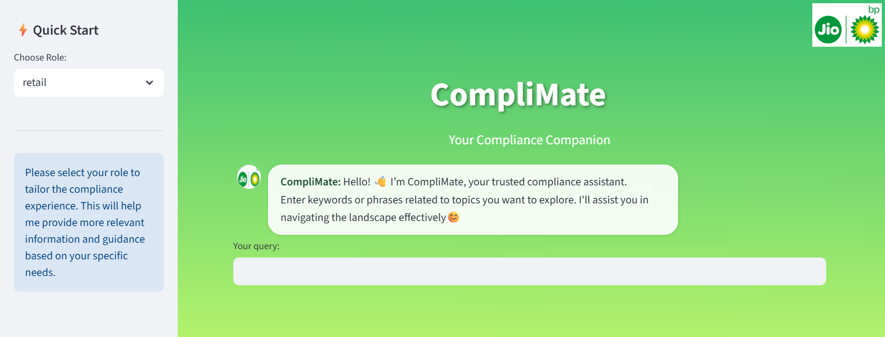

# CompliMate
**AI-powered compliance assistant with role-based search, semantic retrieval, and a Streamlit chat UI for quick access to petroleum regulatory information.**
## 🎥 Demo
Click to view demo👇🏻:
[](https://github.com/user-attachments/assets/321868b8-d132-41de-ba7b-e3f990708521)

---

## 🚀 About the Project

- Your smart companion for quick lookups, clear insights and summarization from dense regulatory files.
- **CompliMate** was created as part of an internship program under **Reliance BP Mobility Limited (d/b/a Jio-bp)**.
- This project processes DOCX and PDF regulatory documents using python-docx and pdf2docx, converts their content into searchable embeddings with sentence-transformers,uses FAISS for fast similarity search to quickly find relevant sections and uses Microsoft's **Phi-3-mini-4k-instruct** (hugging face model) to generate AI answers. Efficient management of document metadata and caching to ensure smooth performance.

## ✨ Features

- Uploaded petroleum regulatory files (docx/pdf) are searched through, relevant information as per user queries are retrieved and answered by AI.
- Chatbot style responses
- This app is deployed via Streamlit Community Cloud.
- App auto-updates whenever code is pushed to the main branch on GitHub..
- For live app visit : **[CompliMate](https://complimate-bysaranyasarangi.streamlit.app/)**
- Has lite version : **[CompliMate Lite](https://github.com/SaranyaSarangi/CompliMate_Lite)** 

## 🛠️ Tech Stack

**Frontend & UI**
- [Streamlit](https://streamlit.io/) – for building the interactive user interface

**Document Processing**
- [python-docx](https://python-docx.readthedocs.io/) – for reading DOCX files
- [pdf2docx](https://pypi.org/project/pdf2docx/) – for converting PDF files to DOCX format(process includes conversion of PDF file to DOCX for better retrieval)

**Search & Retrieval**
- [FAISS](https://faiss.ai/) – for efficient similarity search
- [sentence-transformers](https://www.sbert.net/) – for generating text embeddings
- [difflib](https://docs.python.org/3/library/difflib.html) – for fuzzy matching of text

**Large Language Model (LLM)**
- [Hugging Face](https://huggingface.co/) Inference API – Hosted LLM inference (no local model required).
- Model: **microsoft/Phi-3-mini-4k-instruct** – Lightweight instruction-tuned model optimized for reasoning with short-to-medium contexts.

**Data Handling**
- requests – API calls to Hugging Face models.
- `os`, `json`, `hashlib`, `pickle` – for file handling, metadata storage, caching, and hashing
- Role-based access mapping – for controlling which sections are visible to specific user roles (retail, non_retail)

**Version Control & Deployment**
- [Git](https://git-scm.com/) & [GitHub](https://github.com/) – for version control and code hosting
- [Streamlit Community Cloud](https://streamlit.io/cloud) – for deployment with auto-updates from GitHub

**Source code language**
- 🐍Python

---

## ⚙️ Getting Started

### Prerequisites

- Python 3.10+ (preferably 3.11)
- Streamlit (`pip install streamlit`)
- Other dependencies the app uses (`pip install -r requirements.txt`)

### Installation

1️⃣ Clone the repo  
```bash
git clone https://github.com/SaranyaSarangi/CompliMate_Lite
cd CompliMate
```
2️⃣ Set Up Hugging Face API Token:
Create an access token from [Hugging Face](https://huggingface.co/)

3️⃣ Local Setup (Optional):
If you want to run locally instead of Streamlit Cloud
```bash
pip install -r requirements.txt
```
Create a .streamlit/secrets.toml file:
```toml
HF_API_TOKEN = "your_huggingface_token_here"
```
4️⃣ Upload your compliance documents (DOCX or PDF) in your repo's RAG folder.(optional)

## 🛠️ Deployment
You can deploy locally or on your preferred cloud platform (I've mentioned about Streamlit Cloud below):  
1️⃣ Run the app locally:
```bash
streamlit run CompliMate_app.py
```
2️⃣ Deploy to Streamlit Community Cloud:
Push your code to a GitHub repository and deploy your app via [Streamlit Community Cloud](https://streamlit.io/cloud).
You can click the **Advanced settings** to add the token or
once deployed, open your app’s Settings → Secrets and add:
```toml
HF_API_TOKEN = "your_huggingface_token_here"
```
save and redeploy the app.

## 📦 Usage
- How users can use the app:
Users can enter words or phrases for their concerned topic (e.g."Exemptions for motor conveyance and stationary engines","Testing viscous petroleum"etc.) and click 'Submit'.

- What output or feedback to expect:
CompliMate will retrieve relevant sections and answer using microsoft/Phi-3-mini-4k-instruct via Hugging Face API.

---

## 🔍 RAG Pipeline in CompliMate
CompliMate uses a Retrieval-Augmented Generation (RAG) approach to deliver accurate, document-grounded answers for compliance queries.  
### Pipeline Flow:
**Ingest** – PDF/DOCX files parsed, headings & sections extracted.

**Embed** – Text converted to vectors using Sentence-Transformers.

**Index** – Vectors stored in FAISS for fast similarity search.

**Retrieve** – Top-matching sections found for each query.

**Generate** – Hugging Face LLM (microsoft/Phi-3-mini-4k-instruct) produces grounded answers.

💪🏻From regulation to resolution in seconds — fast retrieval + precise LLM reasoning

### Model used:  
**microsoft/Phi-3-mini-4k-instruct**  
The LLM crafts a clear, concise answer while staying faithful to the retrieved content.

### ✅Why it matters:
Search smarter, answer faster — FAISS-powered retrieval + LLM reasoning ensures compliance answers are both relevant and reliable.

---

## 📌Disclaimer
CompliMate can currently work on **petroleum regulatory documents only**.

## 🤝 Contributing
Contributions are welcome! Please fork the repo, create a new branch for your feature/fix, and submit a pull request.

## 📄 License
This project is licensed under the Apache 2.0 License - see the LICENSE file for details.

## 📞 Contact
- Email : sharanya.sarangi@gmail.com
- [LinkedIn](https://www.linkedin.com/in/saranya-sarangi-5b3745374/)

## 🎉 Acknowledgments
I would like to sincerely thank **Reliance BP Mobility Limited (d/b/a Jio-bp)** for providing me the valuable opportunity to work on this project as part of their internship program. Their support and guidance were instrumental in bringing this project to life.
